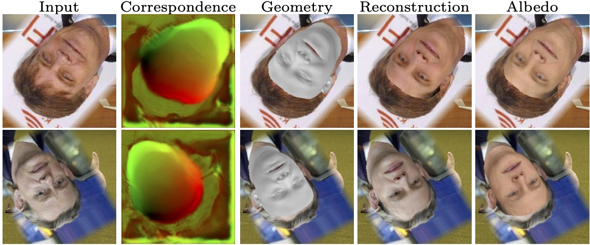

# [“Look Ma, no landmarks!” – Unsupervised, Model-based Dense Face Alignment](https://www.ecva.net/papers/eccv_2020/papers_ECCV/papers/123470681.pdf)

 [Tatsuro Koizumi](https://www.cs.york.ac.uk/cvpr/member/tatsuro/) 1,2 and [William A. P. Smith](https://www-users.cs.york.ac.uk/wsmith) 1
  
 1 University of York, UK
  
 2 Canon, Japan
  
#### [ECCV2020]

 

## Abstract

In this paper, we show how to train an image-to-image network to predict dense correspondence between a face image and a 3D morphable model using only the model for supervision. We show that both geometric parameters (shape, pose and camera intrinsics) and photometric parameters (texture and lighting) can be inferred directly from the correspondence map using linear least squares and our novel inverse spherical harmonic lighting model. The least squares residuals provide an unsupervised training signal that allows us to avoid artefacts common in the literature such as shrinking and conservative underfitting. Our approach uses a network that is 10x smaller than parameter regression networks, significantly reduces sensitivity to image alignment and allows known camera calibration or multi-image constraints to be incorporated during inference. We achieve results competitive with state-of-the-art but without any auxiliary supervision used by previous methods.

## Oral ECCV 2020 presentation

## PyTorch Implementation

Code is coming very soon!

We will provide our own differentiable mesh renderer written entirely in pure PyTorch (no low level CUDA), an implementation and pretrained network for our method and a re-implementation of MoFA.
